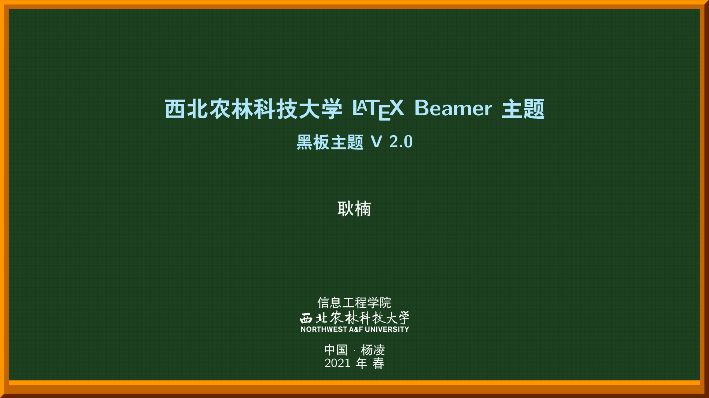
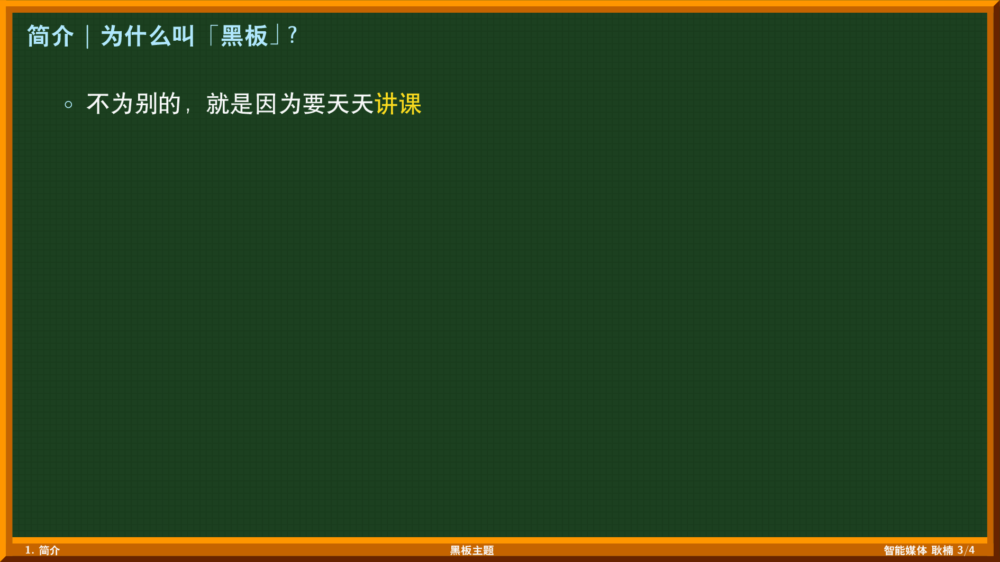
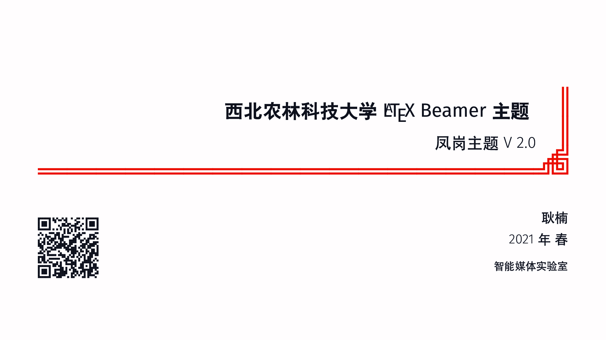
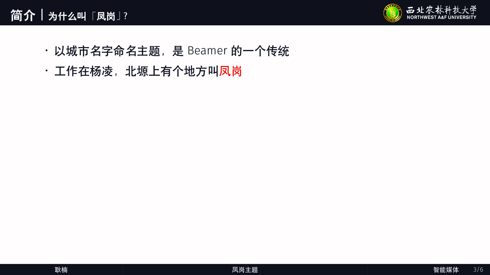
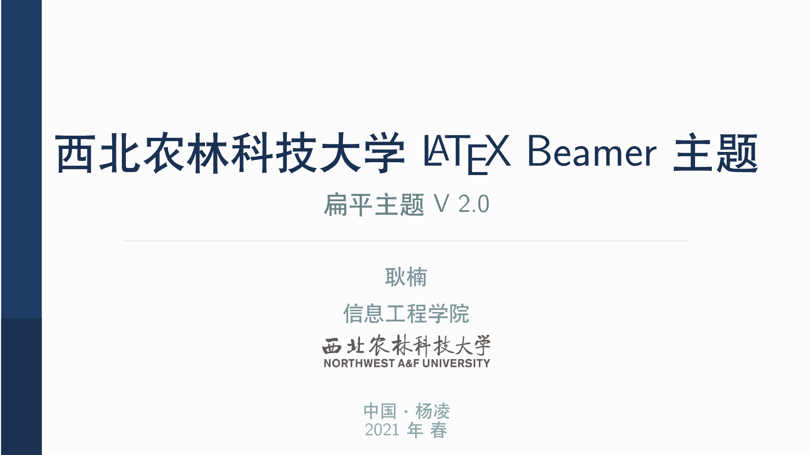
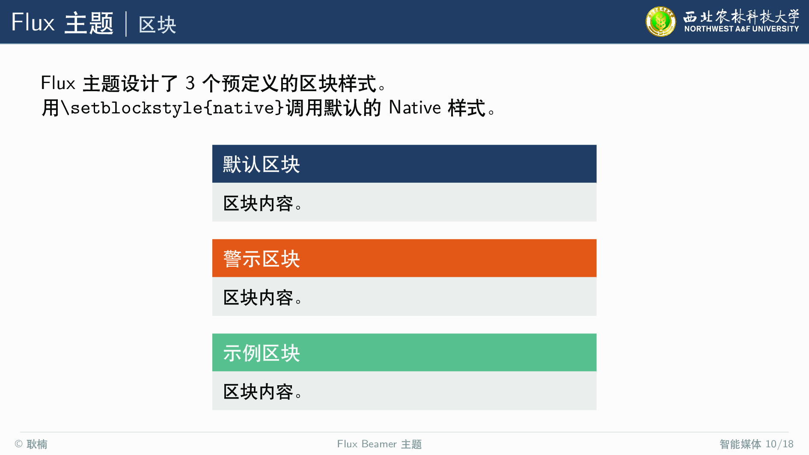
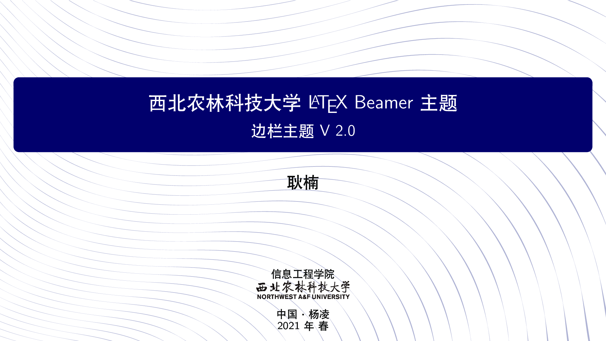
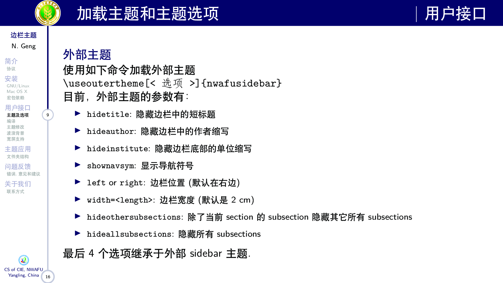
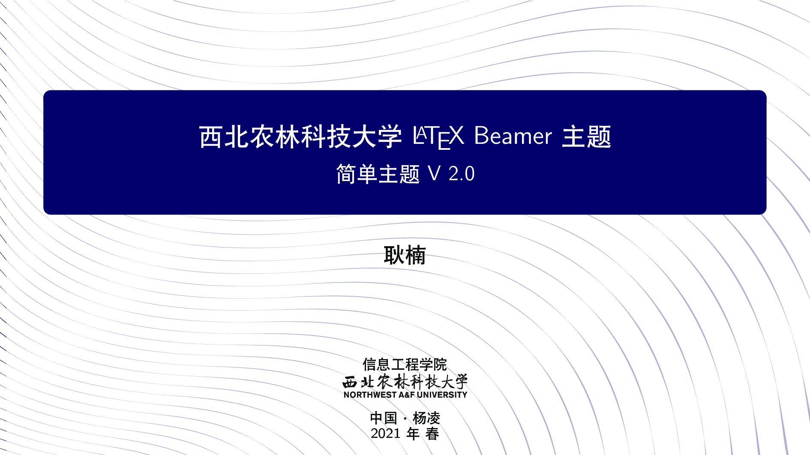
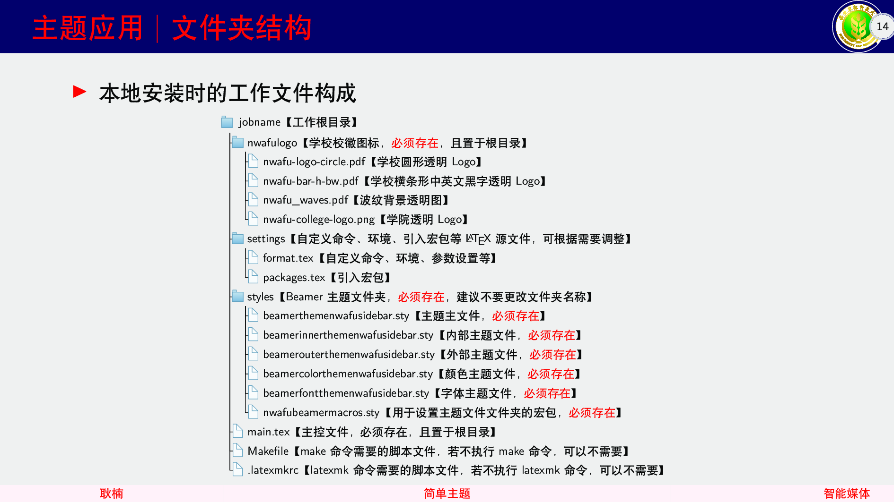

# 一组西北农林科技大学LaTeX Beamer演示文稿主题

这是一组为西北农林科技大学师生讲课或报告用的Beamer演示文稿主题，这些主题原稿来自网络，根据个人理解和习惯进行了调整，主要工作是添加了西北农林科技大学的LOGO。

Happy LaTeXing！~

注意：

1. 本文档要求 TeXLive、MacTeX、MikTeX 不低于 2018 年的发行版，并且尽可能升级到最新，强烈建议使用TeXLive2021。

2. **不支持** [CTeX 套装](http://www.ctex.org/CTeXDownload)。

## 主题名称

1. nwafuBlackBoard：黑板主题，以黑板作为Beamer背景，可以在16:9/4:3屏幕比例之间自由切换。

2. nwafuFenGang：凤岗主题，基于林莲枝的萧山主题，添加了学校Logo、页脚信息。

3. nwafuFlux：扁平主题，基于Flux扁平主题，添加了学校Logo、页脚信息。

4. nwafuSideBar：边栏主题，基于AAU Beamer主题，添加了学校Logo，调整了各部件的大小。

5. nwafuSimple：简单主题，基于AAU Beamer主题，添加了学校Logo、页脚信息。

## 排版样例

## 反馈问题

如果发现代码问题，请按照以下步骤操作：

1. 将 TeX 发行版和宏包升级到最新，并且将模板升级到 Gitee 上最新版本，
查看问题是否已经修复；
2. 在 [Gitee Issues](https://gitee.com/nwafu_nan/nwafu-beamer-theme/issues)
中搜索该问题的关键词；
3. 在 [Gitee Issues](https://gitee.com/nwafu_nan/nwafu-beamer-theme/pulls)
中提出新 issue，并回答以下问题：
    - 使用了什么版本的 TeX Live / MacTeX / MikTeX ？
    - 具体的问题是什么？
    - 正确的结果应该是什么样的？
    - 是否应该附上相关源码或者截图？
4. 联系作者：西北农林科技大学信息工程学院耿楠

## 字体下载

- [iosevka](https://github.com/be5invis/Iosevka/releases)

- [Libertinus](https://github.com/alif-type/libertinus/releases)

- [sarasa-gothic/mono](https://github.com/be5invis/Sarasa-Gothic/releases)

- [SourceHanSerif](https://github.com/adobe-fonts/source-han-serif/releases)

- [SourceHanSans](https://github.com/adobe-fonts/source-han-sans/releases)

## 原主题下载

- [Blackboard主题](https://github.com/kmaed/kmbeamer)

- [萧山主题](https://github.com/liantze/pgfornament-han)

- [Flux扁平主题](https://github.com/pvanberg/flux-beamer)

- [AAU Beamer主题](https://github.com/jkjaer/aauLatexTemplates)

- [双屏主题](https://github.com/dustincys/progressbar)

