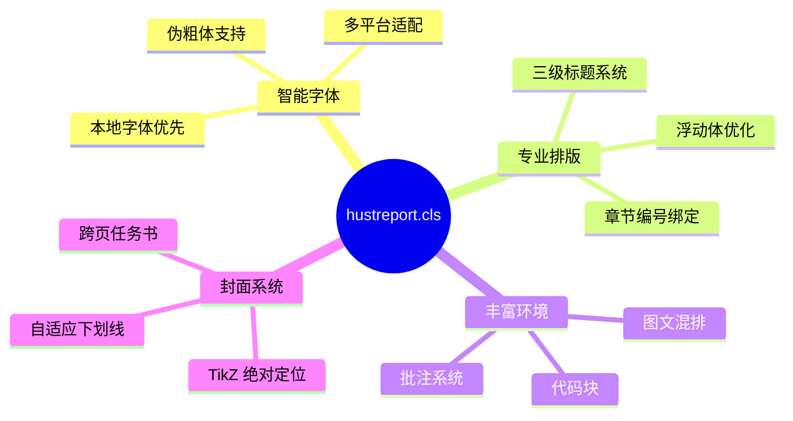
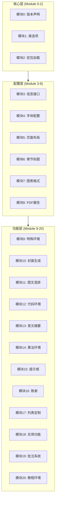
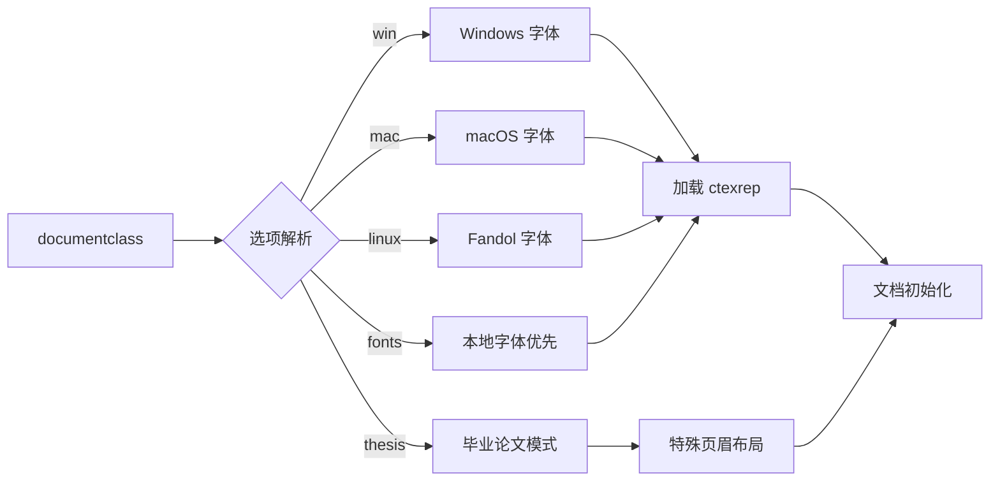
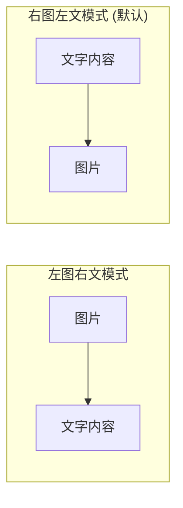
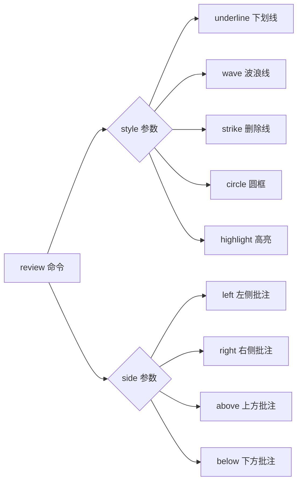
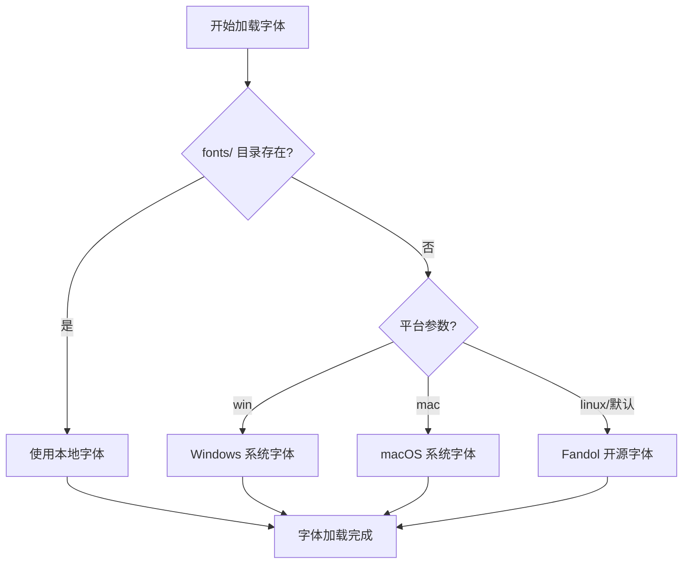

# hustreport.cls 完整使用指南

<div align="center">


**黑龙江科技大学报告/论文模板类**

[快速开始](#-快速开始) •
[模块分析](#-模块架构分析) •
[环境参考](#-环境与命令参考) •
[项目结构](#-项目结构)

</div>

---

## 📋 目录

- [简介](#-简介)
- [快速开始](#-快速开始)
- [模块架构分析](#-模块架构分析)
- [类选项详解](#-类选项详解)
- [环境与命令参考](#-环境与命令参考)
- [项目结构](#-项目结构)
- [常见问题](#-常见问题)

---

## 📖 简介

`hustreport.cls` 是一个为黑龙江科技大学本科生设计的 LaTeX 文档类，支持：

| 文档类型 | 选项 | 特点 |
|----------|------|------|
| 社会调查报告 | 默认 | 简洁页面布局 |
| 实习报告 | 默认 | 封面+任务书 |
| 毕业论文 | `thesis` | 带校徽的专业页眉 |

### 核心特性



---

## 🚀 快速开始

### 最小工作示例

```latex
\documentclass[win]{hustreport}

% 基本信息
\title{我的报告标题}
\author{张三}
\major{计算机科学与技术 2022级}
\dept{计算机学院}
\advisor{李教授}

\begin{document}
    \makecover           % 生成封面
    \tableofcontents     % 目录
    \newpage
    
    \section{引言}
    这是正文内容。
    
\end{document}
```

### 编译命令

```bash
# 单次编译
xelatex your_document.tex

# 完整编译（含参考文献）
xelatex your_document.tex
bibtex your_document
xelatex your_document.tex
xelatex your_document.tex
```

> ⚠️ **重要**：必须使用 **XeLaTeX** 引擎，不支持 pdfLaTeX 或 LuaLaTeX。

---

## 🏗️ 模块架构分析

### 整体架构图



### 模块详细说明

| 模块 | 名称 | 行号 | 核心功能 |
|------|------|------|----------|
| 0 | 版本声明 | 1-14 | `\NeedsTeXFormat`, `\ProvidesClass` |
| 1 | 类选项 | 16-43 | `win/mac/linux/fonts/thesis` 开关 |
| 2 | 宏包加载 | 47-90 | 按功能分类加载 40+ 宏包 |
| 3 | 信息接口 | 92-124 | `\title`, `\author`, `\major` 等 |
| 4 | 字体配置 | 126-254 | 智能检测 + 回退链 |
| 5 | 页面布局 | 256-318 | `geometry` + `fancyhdr` |
| 6 | 章节标题 | 320-377 | `ctexset` 中文标题 |
| 7 | 图表格式 | 379-434 | 浮动体优化 + 编号 |
| 8 | PDF属性 | 438-448 | `hyperref` 配置 |
| 9 | 特殊环境 | 450-528 | 摘要/参考文献/附录 |
| 10 | 封面生成 | 530-680 | TikZ 封面 + xltabular 任务书 |
| 11 | 图文混排 | 682-762 | `textfigure` + `parallelfigures` |
| 12 | 代码环境 | 764-866 | `listings` + `tcolorbox` |
| 13 | 英文摘要 | 869-887 | `enabstract` 环境 |
| 14 | 算法环境 | 889-904 | 算法汉化 |
| 15 | 提示框 | 906-957 | `notice/definition/conclusion` |
| 16 | 致谢 | 959-970 | `acknowledgement` 环境 |
| 17 | 列表定制 | 972-1070 | TikZ 自定义标记 |
| 18 | 实用功能 | 1072-1149 | `todo/fixme/note` |
| 19 | 批注系统 | 1151-1288 | `\review` 命令 |
| 20 | 教程环境 | 1290-1441 | `democode/demovert/apibox` |

---

## ⚙️ 类选项详解

### 选项加载流程



### 选项参数表

| 选项 | 类型 | 默认值 | 说明 |
|------|------|--------|------|
| `win` | 平台 | ❌ | 使用 Windows 系统字体 (SimSun, SimHei, KaiTi) |
| `mac` | 平台 | ❌ | 使用 macOS 系统字体 (Songti SC, Heiti SC) |
| `linux` | 平台 | ✅ | 使用 Fandol 开源字体 (默认) |
| `fonts` | 字体 | ❌ | 强制优先使用 `fonts/` 目录本地字体 |
| `thesis` | 模式 | ❌ | 启用毕业论文模式 (带校徽页眉) |

### 使用示例

```latex
% Windows 用户
\documentclass[win]{hustreport}

% macOS 用户 + 毕业论文
\documentclass[mac,thesis]{hustreport}

% Linux 用户 + 本地字体
\documentclass[linux,fonts]{hustreport}
```

---

## 📚 环境与命令参考

### 信息设置命令

这些命令用于设置文档元信息，必须在 `\begin{document}` 之前调用：

| 命令 | 参数 | 必填 | 说明 | 示例 |
|------|------|------|------|------|
| `\title{...}` | 标题文本 | ✅ | 报告/论文标题 | `\title{大学生消费调查}` |
| `\author{...}` | 姓名 | ✅ | 组长/作者姓名 | `\author{张三}` |
| `\team{...}` | 姓名列表 | ❌ | 队员姓名，逗号分隔 | `\team{李四，王五}` |
| `\major{...}` | 专业年级 | ✅ | 专业名称+年级 | `\major{计算机 2022级}` |
| `\dept{...}` | 院系名称 | ✅ | 所属院系 | `\dept{计算机学院}` |
| `\advisor{...}` | 教师姓名 | ✅ | 指导教师 | `\advisor{李教授}` |
| `\studentID{...}` | 学号 | ❌ | 学号（论文用） | `\studentID{2022001}` |
| `\reportID{...}` | 编号 | ❌ | 报告编号 | `\reportID{2025-001}` |

---

### 封面与任务书

#### `\makecover` - 生成封面

```latex
% 语法
\makecover

% 完整示例
\title{大学生消费行为调查报告}
\author{张三}
\team{李四，王五，赵六}
\major{市场营销 2022级}
\dept{经济管理学院}
\advisor{王教授}
\reportID{2025-JGXY-001}

\begin{document}
    \makecover  % 自动读取上述信息生成封面
\end{document}
```

**封面效果**：右上角校徽 + 居中标题 + 信息表格 + 日期

---

#### `\maketaskbook` - 生成任务书

**前置配置**（必须在调用前设置）：

```latex
% 调查目标
\renewcommand{\taskTargetText}{
    \begin{enumerate}
        \item 了解大学生月均消费水平
        \item 分析消费结构及影响因素
        \item 提出合理消费建议
    \end{enumerate}
}

% 方案设计
\renewcommand{\taskContentText}{
    采用问卷调查法，设计包含 20 道题目的调查问卷，
    通过线上发放收集数据，使用 SPSS 进行统计分析。
}

% 预期结果
\renewcommand{\taskExpectedText}{
    形成一份完整的调查报告，包含数据分析和建议。
}

% 进度安排
\renewcommand{\taskScheduleText}{
    第1周：问卷设计 \\
    第2周：数据收集 \\
    第3周：数据分析 \\
    第4周：撰写报告
}

\begin{document}
    \maketaskbook  % 生成任务书（支持跨页）
\end{document}
```

---

### 摘要环境

#### `cnabstract` - 中文摘要

| 参数 | 位置 | 必填 | 说明 |
|------|------|------|------|
| 关键词 | `{...}` | ✅ | 关键词列表，分号分隔 |

```latex
\begin{cnabstract}{消费行为；大学生；消费结构}
    本文通过问卷调查的方式，对黑龙江科技大学在校本科生的
    消费行为进行了调查研究。结果表明，大学生月均消费水平
    在 1500-2500 元之间，餐饮和学习用品为主要支出项目。
\end{cnabstract}
```

**输出效果**：

- 自动添加到目录
- 标题居中显示
- 关键词自动格式化

---

#### `enabstract` - 英文摘要

| 参数 | 位置 | 必填 | 说明 |
|------|------|------|------|
| Keywords | `{...}` | ✅ | 英文关键词列表 |

```latex
\begin{enabstract}{Consumer Behavior; College Students; Consumption Pattern}
    This paper investigates the consumption behavior of undergraduate 
    students at HUST through questionnaire surveys. The results show 
    that the average monthly consumption is between 1500-2500 RMB.
\end{enabstract}
```

---

### 图文混排环境

#### `textfigure` - 图文并排



| 参数 | 位置 | 必填 | 默认值 | 说明 |
|------|------|------|--------|------|
| 位置 | `[...]` | ❌ | `right` | `left`=左图右文, `right`=右图左文 |
| 图片路径 | `{...}` | ✅ | - | 图片文件路径 |
| 标题 | `{...}` | ✅ | - | 图片标题 |
| 宽度比例 | `[...]` | ❌ | `0.4` | 图片占行宽比例 (0-1) |

```latex
% 语法
\begin{textfigure}[位置]{图片路径}{标题}[宽度比例]
    文字内容...
\end{textfigure}

% 示例1：右图左文（默认）
\begin{textfigure}{figure/chart1.png}{消费结构饼图}
    根据调查数据，大学生消费主要集中在餐饮（45\%）、
    学习用品（25\%）和娱乐（15\%）三个方面。
\end{textfigure}

% 示例2：左图右文 + 自定义宽度
\begin{textfigure}[left]{figure/chart2.png}{月均消费趋势}[0.5]
    从时间维度来看，消费水平呈现逐年上升趋势，
    尤其是在电子产品和娱乐消费方面增长明显。
\end{textfigure}
```

---

#### `parallelfigures` - 并排多图

| 参数 | 位置 | 必填 | 说明 |
|------|------|------|------|
| 总标题 | `{...}` | ✅ | 整组图片的总标题 |

**内部命令 `\addfig`**：

| 参数 | 位置 | 必填 | 默认值 | 说明 |
|------|------|------|--------|------|
| 宽度比例 | `[...]` | ❌ | `0.48` | 单图占行宽比例 |
| 图片路径 | `{...}` | ✅ | - | 图片文件路径 |
| 子标题 | `{...}` | ✅ | - | 子图标题 |

```latex
% 语法
\begin{parallelfigures}{总标题}
    \addfig[宽度]{路径}{子标题}
    \addfig[宽度]{路径}{子标题}
\end{parallelfigures}

% 示例：三图并排
\begin{parallelfigures}{不同年级消费对比}
    \addfig[0.32]{figure/grade1.png}{大一}
    \addfig[0.32]{figure/grade2.png}{大二}
    \addfig[0.32]{figure/grade3.png}{大三}
\end{parallelfigures}

% 示例：两图并排（默认宽度 0.48）
\begin{parallelfigures}{性别消费差异}
    \addfig{figure/male.png}{男生}
    \addfig{figure/female.png}{女生}
\end{parallelfigures}
```

**子图编号**：主图采用"章节-序号"格式（如 图 14-1），子图自动采用 (a)、(b)、(c) 格式。

---

#### `figurerow` - 自动等宽行布局 (v3.0 新增)

| 参数 | 位置 | 必填 | 默认值 | 说明 |
|------|------|------|--------|------|
| 总标题 | `{...}` | ✅ | - | 整组图片的总标题 |
| 列数 | `[...]` | ❌ | `2` | 图片列数，自动计算宽度 |

```latex
% 语法
\begin{figurerow}{总标题}[列数]
    \figitem{路径}{子标题}
    \figitem{路径}{子标题}
\end{figurerow}

% 示例：3列自动等宽
\begin{figurerow}{三张图并排}[3]
    \figitem{figure/img1.png}{子图 A}
    \figitem{figure/img2.png}{子图 B}
    \figitem{figure/img3.png}{子图 C}
\end{figurerow}
```

---

#### `figuregrid` - 网格布局 (v3.0 新增)

支持 2×2、2×3 等任意网格布局：

```latex
% 语法
\begin{figuregrid}{总标题}
    \gridrow{
        \gridfig[宽度]{路径}{子标题}
        \gridfig[宽度]{路径}{子标题}
    }
    \gridrow{...}
\end{figuregrid}

% 示例：2×2 网格
\begin{figuregrid}{四组数据对比}
    \gridrow{
        \gridfig{figure/a.png}{(a) 第一季度}
        \gridfig{figure/b.png}{(b) 第二季度}
    }
    \gridrow{
        \gridfig{figure/c.png}{(c) 第三季度}
        \gridfig{figure/d.png}{(d) 第四季度}
    }
\end{figuregrid}
```

---

### 代码环境

#### `codeblock` - 行内代码块

| 参数 | 位置 | 必填 | 默认值 | 说明 |
|------|------|------|--------|------|
| 语言 | `[...]` | ❌ | `c` | 编程语言 |
| 标题 | `{...}` | ✅ | - | 代码块标题 |

```latex
% 语法
\begin{codeblock}[语言]{标题}
代码内容...
\end{codeblock}

% 示例
\begin{codeblock}[python]{数据清洗脚本}
import pandas as pd

def clean_data(df):
    # 删除缺失值
    df = df.dropna()
    # 去除异常值
    df = df[df['amount'] > 0]
    return df
\end{codeblock}
```

**支持的语言**：`python`, `c`, `cpp`, `java`, `javascript`, `bash`, `sql`, `latex`, `matlab`, `r`

---

#### `\filecode` - 外部文件导入

| 参数 | 位置 | 必填 | 默认值 | 说明 |
|------|------|------|--------|------|
| 语言 | `[...]` | ❌ | `c` | 编程语言 |
| 标题 | `{...}` | ✅ | - | 代码块标题 |
| 文件路径 | `{...}` | ✅ | - | 代码文件路径 |

```latex
% 语法
\filecode[语言]{标题}{文件路径}

% 示例
\filecode[python]{数据分析主程序}{code/analysis.py}
\filecode[sql]{数据库查询语句}{code/query.sql}
```

---

### 提示框环境

#### `notice` - 注意框（蓝色）

```latex
\begin{notice}{重要提醒}
    编译本模板必须使用 XeLaTeX 引擎，否则中文无法正常显示。
\end{notice}
```

#### `definition` - 定义框（绿色）

```latex
\begin{definition}{边际消费倾向}
    边际消费倾向（MPC）是指每增加一单位收入中用于消费的比例，
    计算公式为：$MPC = \Delta C / \Delta Y$
\end{definition}
```

#### `conclusion` - 结论框（红色）

```latex
\begin{conclusion}{主要发现}
    本研究发现，大学生消费行为受家庭收入、个人理财意识
    和社交需求三个因素的显著影响。
\end{conclusion}
```

---

### 批注系统

#### `\review` - 高级批注命令



| 参数 | 类型 | 必填 | 默认值 | 可选值 |
|------|------|------|--------|--------|
| `style` | 选项 | ❌ | `underline` | `underline`, `wave`, `strike`, `circle`, `highlight` |
| `color` | 选项 | ❌ | `red` | 任意颜色名或 RGB |
| `side` | 选项 | ❌ | `right` | `left`, `right`, `above`, `below` |
| `offset` | 选项 | ❌ | `0pt` | 长度值如 `5pt`, `-3mm` |
| 被标注文本 | `{...}` | ✅ | - | 正文中需要标注的文字 |
| 批注内容 | `{...}` | ✅ | - | 批注说明文字 |

```latex
% 语法
\review[style=样式, color=颜色, side=位置]{被标注文本}{批注内容}

% 示例1：默认样式（红色下划线 + 右侧批注）
\review{这段表述不够准确}{请核实数据来源}

% 示例2：高亮 + 上方批注
\review[style=highlight, color=yellow, side=above]
       {消费增长率达到 15\%}{数据需要更新}

% 示例3：波浪线 + 左侧批注
\review[style=wave, color=blue, side=left]
       {相关系数为 0.85}{统计显著性？}

% 示例4：删除线（标记待删除内容）
\review[style=strike, color=gray]
       {这段内容可以删除}{}
```

---

### 待办提示命令

| 命令 | 颜色 | 用途 |
|------|------|------|
| `\todo{...}` | 橙色 | 待办事项 |
| `\fixme{...}` | 红色 | 需要修复 |
| `\note{...}` | 蓝色 | 备注说明 |

```latex
\todo{补充第三章的数据分析}

\fixme{表格格式需要调整，数值保留两位小数}

\note{这部分引用需要核实原文出处}
```

---

### 附录环境

```latex
\begin{appendixblock}
    \section{调查问卷}
    % 显示为 "附录A"
    问卷内容...
    
    \section{原始数据}
    % 显示为 "附录B"
    数据表格...
    
    \section{程序代码}
    % 显示为 "附录C"
    \filecode[python]{数据处理脚本}{code/process.py}
\end{appendixblock}
```

---

### 参考文献

#### `\MyBibliography` - BibTeX 自动加载

```latex
% 在 ref.bib 文件中定义参考文献
% 然后在文档末尾调用：
\MyBibliography{ref}
```

#### `\upcite` - 上标引用

```latex
根据相关研究\upcite{ref1}，大学生消费行为受多种因素影响。
% 输出：根据相关研究[1]，...（1 为上标）
```

---

### 教程文档环境

这些环境专门用于编写 LaTeX 教程文档：

#### `democode` - 左右并排（代码 + 效果）

```latex
\begin{democode}{加粗与斜体}
这是 \textbf{加粗} 和 \textit{斜体} 文本。
\end{democode}
```

#### `demovert` - 上下布局（代码 + 效果）

```latex
\begin{demovert}{列表示例}
\begin{itemize}
    \item 第一项
    \item 第二项
\end{itemize}
\end{demovert}
```

#### `codeonly` - 仅展示代码

```latex
\begin{codeonly}{配置示例}
\documentclass[win,thesis]{hustreport}
\end{codeonly}
```

#### `\apibox` - API 参考卡片

```latex
\apibox{makecover}{无参数}{生成标准报告封面页}
```

---

## 📁 项目结构

```
your_project/
├── main.tex              # 主文档
├── ref.bib               # 参考文献数据库
├── hustreport.cls        # 模板类文件 ⭐
│
├── fonts/                # [可选] 本地字体目录
│   ├── SimSun.ttf        # 宋体
│   ├── SimHei.ttf        # 黑体
│   ├── KaiTi.ttf         # 楷体
│   ├── times.ttf         # Times New Roman
│   ├── timesbd.ttf       # Times Bold
│   ├── timesi.ttf        # Times Italic
│   └── timesbi.ttf       # Times BoldItalic
│
├── figure/               # 图片目录
│   ├── chart1.png
│   └── chart2.png
│
├── code/                 # 代码文件目录
│   ├── analysis.py
│   └── query.sql
│
├── assets/               # 资源文件
│   └── logo.png          # 校徽（封面用）
│
└── chapters/             # [可选] 分章节文件
    ├── chapter1.tex
    ├── chapter2.tex
    └── appendix.tex
```

### 字体配置优先级



---

## ❓ 常见问题

### Q1: 编译报错 "Font not found"

**解决方案**：

1. 确保使用正确的平台选项 (`win`/`mac`/`linux`)
2. 或将字体文件放入 `fonts/` 目录

### Q2: 中文显示为方框

**解决方案**：

1. 确保使用 XeLaTeX 编译
2. 检查系统是否安装中文字体

### Q3: 图片不显示

**解决方案**：

1. 确保图片路径正确
2. 支持格式：`.png`, `.jpg`, `.pdf`
3. 避免路径中包含中文或空格

### Q4: 目录页码不正确

**解决方案**：
多次编译（至少 2 次）以更新交叉引用

---

## 📄 许可证

本模板仅供黑龙江科技大学师生学习使用。

---

<div align="center">

**Made with ❤️ for HUST Students**

</div>
